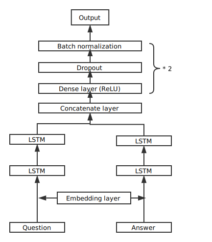

# Task
Answer Sentence Selection, given a factoid question, find the sentence in the candidate set. The performance is evaluated by Mean Reciprocal Rank (MRR). 

# Dataset
You can find the dataset at [WikiQA]([https://www.microsoft.com/en-us/research/publication/wikiqa-a-challenge-dataset-for-open-domain-question-answering/).

In the testing stage, I removed questions without a correct answer.

# Model



The question and answer pair is first fed into the shared embedding layer and then to two LSTM layers separately.

The outputs of LSTM layers are concatenated as the input to a dense layer with ReLU activation. To prevent overfitting, dropout and batch normalization are added. There are two dense layers with dropout and batch normalization.

The final layer of the networks is also a dense layer with one dimension output and sigmoid activation. The output can be regarded as the possibility of the answer can support the question.

As it is a binary classification task, binary cross entropy is used as the loss. Adam optimizer is used to train this model.

# Restful API

## predict
Sample input:
```json
{
    "questions": ["first question?", "second question"],
    "answers": ["first answer", "second answer"]
}
```
Notice:
1. the questions and answers must have the same length
2. Even for only one question and answer, you should also put them in a list separately

Sample output:
```json
[
    0, 1
]
```
Notice: 0 for false and 1 for true

## Rank
Sample input:
```json
{
    "questions": ["first question?", "second question"],
    "answers":
     [
        ["candidate 1 for first answer", "candidate 2 for first answer"], 
        ["candidate 2 for first answer"]
     ]
}
```
Notice:
1. the questions and answers must have the same length
2. Each item in the answer list is a list of candidate answers

Sample output:
```json
[
    [
        1,
        0
    ],
    [
        0
    ]
]
```
Notice: each item in the result list is the rank of candidates in their index

# Run

## Train model:
1. Preprocess:
```
python data_process.py
```

2. Train

```
python main.py --embedding_file=/path/to/embeddings --data="data"
```
after run `python data_process.py`, the processed data will be in `./data`. The embedding file you can download from [here](http://nlp.stanford.edu/data/glove.6B.zip) and you can use `glove.6B.50d.txt` or others.

## Start Restful API
To start this Restful API, trained model and vocabulary is needed. To generate them, you can run the previous command. Also, this project contains a trained model and vocabulary, directly run this command is also OK.
```
python start_api.py
```

## Using Anaconda3
After `conda install --yes -c conda-forge --file requirements.txt`, there may packages can not be installed. You can install them manually.
